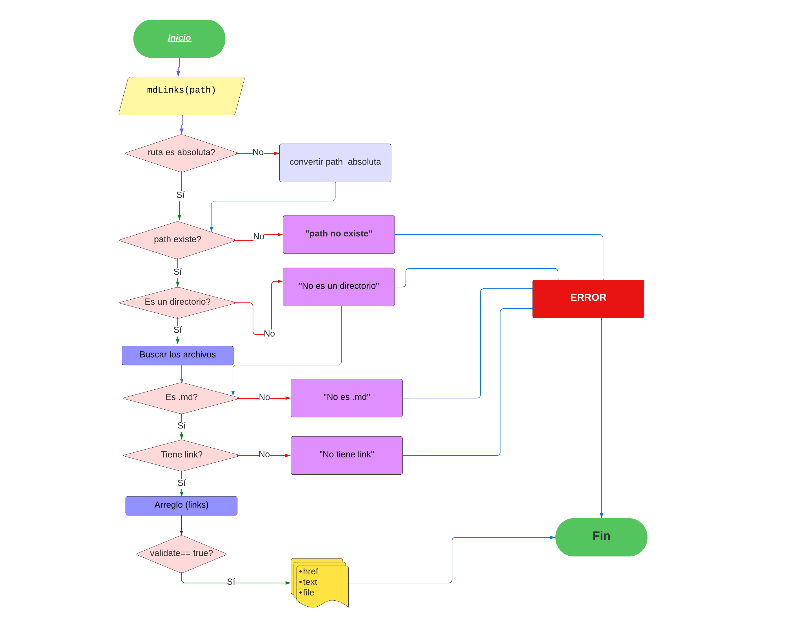

# Markdown Links

## Índice

* [1. Preámbulo](#1-preámbulo)
* [2. Resumen del proyecto](#2-resumen-del-proyecto)
* [3. Funcionalidades](#3-funcionalidades)
* [4. Instalación](#4-instalación)
* [5. Usando la Librería](#5-usando-la-librería)
* [6. Archivos que contiene el proyecto](#6-archivos-que-contiene-el-proyecto)
* [7. Diagrama de flujo](#7-diagrama-de-flujo)
* [8. Conclusión](#8-conclusión)
****
****


## 1. Preámbulo

[Markdown](https://es.wikipedia.org/wiki/Markdown) es un lenguaje de marcado
ligero muy popular entre developers. Es usado en
muchísimas plataformas que manejan texto plano (GitHub, foros, blogs, etc.) y
es muy común encontrar varios archivos en ese formato en cualquier tipo de
repositorio (empezando por el tradicional `README.md`).

Estos archivos `Markdown` normalmente contienen _links_ (vínculos/ligas) que
muchas veces están rotos o ya no son válidos y eso perjudica mucho el valor de
la información que se quiere compartir.

****
****
## 2. Resumen del proyecto


El proyecto "mdlinks" es una biblioteca creada con Node.js que tiene como objetivo leer y analizar archivos escritos en formato Markdown. Su propósito principal es identificar y comprobar los enlaces contenidos en estos archivos, además de proporcionar estadísticas relevantes relacionadas con los enlace.

En resumen, la herramienta mdlinks está diseñada para inspeccionar todos los enlaces dentro de archivos Markdown, verificar su estado y simplificar la detección de enlaces duplicados, enlaces rotos y enlaces válidos.

****
****
## 3. Funcionalidades:

La librería mdlinks es una herramienta que acepta un archivo o directorio como su parámetro principal. Si se proporciona una ruta relativa, la librería la convierte en una ruta absoluta. Luego, mdlinks lee el contenido del archivo o directorio y crea un arreglo que contiene todos los enlaces encontrados en ese archivo o carpeta. Cada enlace en el arreglo incluye tres elementos: la dirección del enlace (href), el texto relacionado y la ruta de origen del enlace.

La librería mdlinks ofrece opciones adicionales que tienen funciones específicas:

- `--validate`: Este comando se utiliza para verificar el estado de los enlaces. Cuando se activa, **mdlinks** agrega información adicional al arreglo original, incluyendo el estado del enlace (`status`), que indica el código de respuesta HTTP, y una etiqueta (`ok`) que indica si el enlace es válido o no en función del código de respuesta.

- `--validate --stats`: El uso de ambos comandos en conjunto devuelve un objeto con estadísticas detalladas. Esto incluye el recuento total de enlaces, la cantidad de enlaces únicos y la cantidad de enlaces rotos.

- `--stats`: Este comando devuelve un objeto de estadísticas que informa el número total de enlaces encontrados y el número de enlaces únicos.

En resumen, la librería **mdlinks** es una utilidad versátil que permite analizar y verificar enlaces en archivos Markdown, proporcionando información adicional y estadísticas útiles según las necesidades del usuario.
****
****

## 4. Instalación

Para instalar la herramienta, se debe ejecutar el siguiente comando en la terminal:

```
npm install KellPitt19/DEV009-mdlinks
```
****
****
## 5. Usando la librería

Después de instalar la librería, el usuario puede utilizar el comando mdlinks en la terminal, seguido de la ruta del archivo o carpeta que desea analizar en busca de enlaces.

 ```
 mdlinks 'ingresar-la-ruta.md'
 ```
 
El uso de este primer parámetro es esencial, ya que es un requisito obligatorio. Si no se proporciona una ruta, la herramienta mostrará el siguiente mensaje de error.

 ```
 mdlinks 'Error: se-ncesita-una-ruta'
 ```
Además de este parámetro principal, existen opciones adicionales. La primera de ellas es --validate, que proporciona información sobre el estado de los enlaces en la ruta.
```
 mdlinks 'ingresar-la-ruta.md' --validate
 ```

La segunda opción es --stats, que genera un conjunto de estadísticas que incluyen la cantidad total de enlaces y la cantidad de enlaces únicos en la ruta.
```
 mdlinks 'ingresar-la-ruta.md' --stats
 ```

Finalmente, tienes la opción de combinar las dos anteriores: --validate --stats, lo que te proporcionará estadísticas que incluyen información sobre los enlaces rotos en el archivo que se está analizando.
```
 mdlinks 'ingresar-la-ruta.md' --validate --stats
 ```
****
****
 ## 6. Archivos que contiene el proyecto

* `data.js:` Dentro de este archivo se encuentran todas las funciones puras que implementan operaciones relacionadas con el sistema de archivos y rutas de Node.js. También incluye implementaciones de bibliotecas como Axios y Markdown-it.

* `index.js:` Este archivo actúa como la Interfaz de Línea de Comando (CLI). Su función principal es exportar y ejecutar la función mdlinks() con todos sus parámetros, lo que permite interactuar con la herramienta desde la línea de comandos.

* `mdlinks.js:` En este archivo se aloja la función global mdlinks(). Aquí se exportan e implementan las funciones puras contenidas en data.js, lo que permite ejecutar todas las funcionalidades de la herramienta.

* `package.json:` Dentro de este archivo se almacena información vital del proyecto, como su nombre, versión, descripción, autora, licencia, dependencias, scripts, archivo principal (main), y configuraciones para la línea de comandos (bin).

* `test:` Esta carpeta contiene pruebas unitarias diseñadas para evaluar la función mdLinks() y también las funciones puras contenidas en data.js.

* `Archivos y carpetas de prueba:` En el proyecto, se incluyen varios archivos y carpetas que sirven para realizar pruebas de funcionalidad.

****
****
## 7. Diagrama de flujo

El proyecto sigue un procedimiento lógico que consta de una serie de etapas, y este proceso se detalla en el siguiente diagrama de flujo.



****
****
## 8. Conclusión

El proyecto es un conjunto organizado de archivos y carpetas que desempeñan roles específicos en su funcionamiento. El archivo package.json actúa como un repositorio de información esencial, que incluye detalles como el nombre, la versión, la descripción, el autor, la licencia, las dependencias, los scripts, el archivo principal y configuraciones para la línea de comandos. La carpeta test alberga pruebas unitarias que se utilizan para evaluar la función mdLinks() y las funciones puras en data.js. Además, se proporcionan archivos y carpetas de prueba adicionales para verificar y validar la funcionalidad del proyecto.

El proyecto sigue un proceso lógico que se presenta de manera visual a través de un diagrama de flujo. Este diagrama muestra cómo las diferentes partes del proyecto interactúan en un flujo secuencial, lo que ayuda a comprender mejor su funcionamiento general.

En resumen, el proyecto está diseñado de manera organizada y estructurada, con información esencial en package.json, pruebas en la carpeta test, y un diagrama de flujo que ilustra el proceso general. Estos elementos contribuyen a la eficacia y comprensión del proyecto.