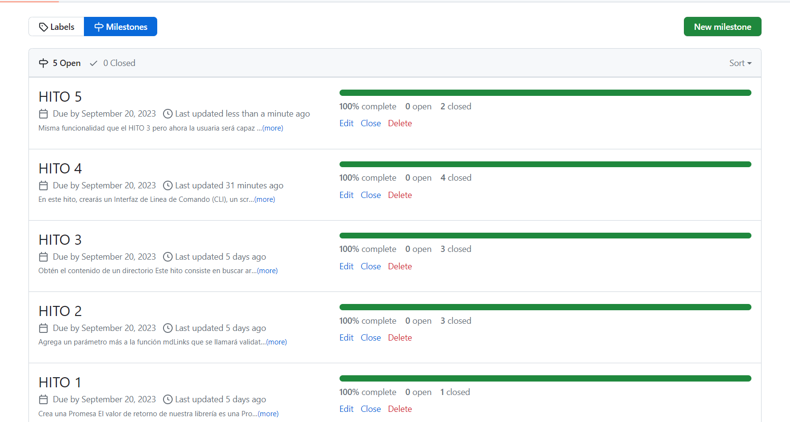
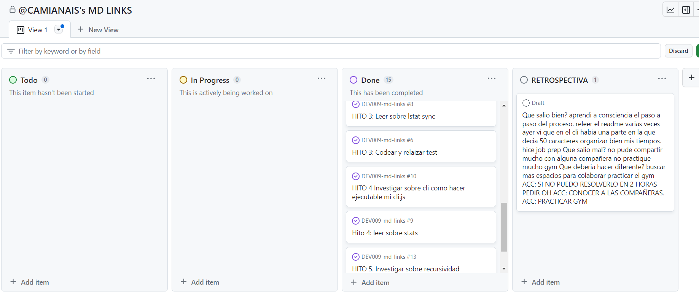
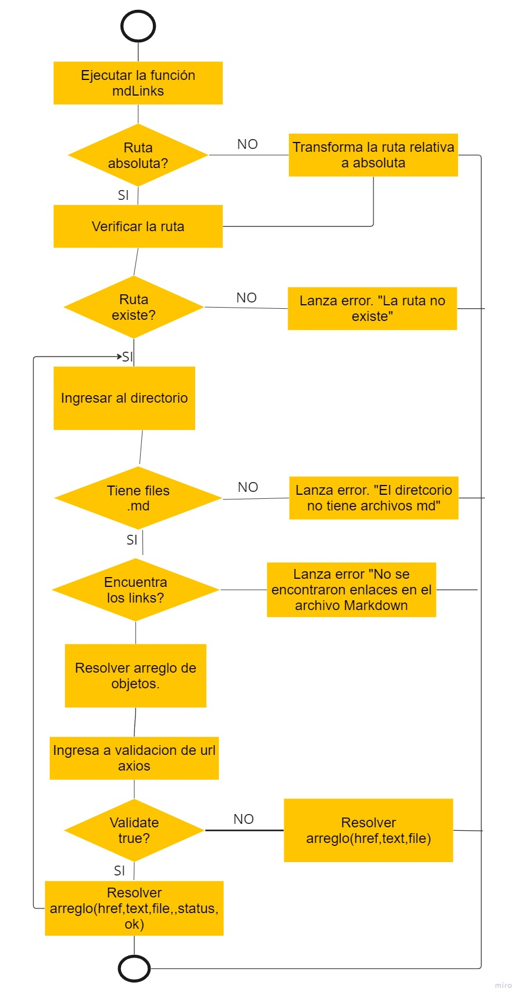
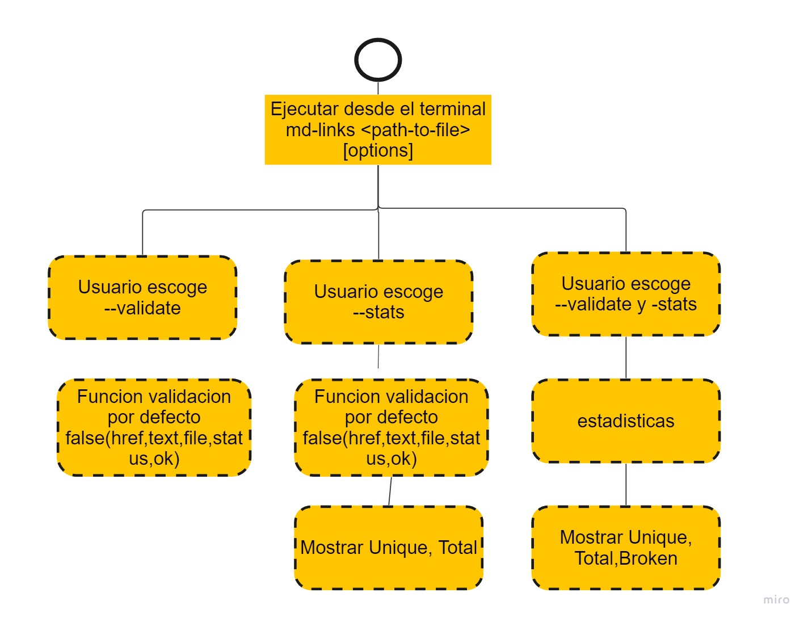

# Markdown Links

## Índice

* [1. Preámbulo](#1-preámbulo)
* [2. Resumen del proyecto](#2-resumen-del-proyecto)
* [3. Documentación técnica de la libreria](#3-documentación-técnica-de-la-libreria)
* [4. Guía de uso](#4-Guía-de-uso)
* [5. Instalación de la libreria](#5-Instalación-de-la-libreria)
* [6. Planificación del proyecto](#6-Planificación-del-proyecto)

***

## 1. Preámbulo

[Markdown](https://es.wikipedia.org/wiki/Markdown) es un lenguaje de marcado
ligero muy popular entre developers. Es usado en
muchísimas plataformas que manejan texto plano (GitHub, foros, blogs, etc.).

Estos archivos `Markdown` normalmente contienen _links_ (vínculos/ligas) que
muchas veces están rotos o ya no son válidos y eso perjudica mucho el valor de
la información que se quiere compartir.

Se ha creado una herramienta usando [Node.js](https://nodejs.org/), que lea y analice archivos en formato `Markdown`, para verificar los links que contengan y reportar
algunas estadísticas.

## 2. Resumen del proyecto

En este proyecto se desarrolló una librería en Node.js que funciona como
herramienta para analizar links dentro de archivos Markdown. Esta librería
está disponible de dos formas: como un módulo publicado en GitHub, que las
usuarias podrán instalar e importar en otros proyectos, y como una interfaz
de línea de comandos (CLI) que permitirá utilizar la librería directamente
desde el terminal.

Se puede instalar esta librería utilizando NPM (Node Package
Manager).

```npm install CAMIANAIS/DEV009-md-links```


## 3. Documentación técnica de la libreria

  En este proyecto se hizo uso de Los módulos CommonJS usan la síntaxis `require`, también la librería `Markdown-it`.

  Además,se configuró Jest para realizar los test unitarios,se utilizó el matcher `.resolves` en su declaración de expect y Jest esperará a que esa promesa resuelva. Si se rechaza la promesa, la prueba fallará automáticamente.

  Se evitó el uso de la función síncrona `readFileSync` para leer archivos. En su lugar, se hizo de manera asíncrona utilizando `readFile`. 

  Se utilizó el módulo `fs/promises`, podrás utilizar la versión promisificada de las funciones como `readFile`.

  Al momento de usar recursividad, se utilizó la versión síncrona de la función para leer directorios, `readdirSync`.


## 4. Guía de uso

Al ejecutar el siguiente comando:

```md-links ./library```

Se obtendrá un arreglo de objetos con las propiedades:

* `href`: URL encontrada.
* `text`: Texto que aparecía dentro del link (`<a>`).
* `file`: Ruta del archivo donde se encontró el link.

```shell
  {
    href: 'https://trello.com/b/xQ8nT574/md-links',
    text: 'Trello',
    file: 'C:\\Users\\Cami\\Desktop\\MDLINKS\\DEV009-md-links\\directory\\anothermd.md',
  },
  {
    href: 'https://github.com/Laboratoria/DEV009-md-links',
    text: 'miro',
    file: 'C:\\Users\\Cami\\Desktop\\MDLINKS\\DEV009-md-links\\directory\\moremd\\other.md',
  },
  {
    href: 'https://www.cdn-net.com/s2?t=AQ7zQwm6kMWkBttXR2cbKQP8&x=1&sid=d2ff4cea12357d90&tid=e034001ff55c9b16df7f8cfac1aad3b41170113ec26fd1578aad053c7577da6cEHCDXX',
    text: 'cdn',
    file: 'C:\\Users\\Cami\\Desktop\\MDLINKS\\DEV009-md-links\\directory\\thiismdfile\\brokenlinks.md',
  },
  {
    href: 'https://www.openai.com',
    text: 'OpenAI',
    file: 'C:\\Users\\Cami\\Desktop\\MDLINKS\\DEV009-md-links\\directory\\thisismd.md',
  },
  {
    href: 'https://moodle.isur.edu.p',
    text: 'Moodle',
    file: 'C:\\Users\\Cami\\Desktop\\MDLINKS\\DEV009-md-links\\directory\\thisismd.md',
  },
  {
    href: 'https://www.google.com/estaesunaurlinvalida',
    text: 'Google',
    file: 'C:\\Users\\Cami\\Desktop\\MDLINKS\\DEV009-md-links\\directory\\thisismd.md',
  }
```

3. Comando `--validate`

Ejecutar --> `md-links ./directory --validate`

Obtendremos un arreglo de objetos con las propiedades:

* `href`: URL encontrada.
* `text`: Texto que aparecía dentro del link (`<a>`).
* `file`: Ruta del archivo donde se encontró el link.
* `status`: Código de respuesta HTTP.
* `ok`: Mensaje `fail` en caso de fallo de lo contrario `ok` en caso de éxito.

```shell
  {
    href: 'https://trello.com/b/xQ8nT574/md-links',
    text: 'Trello',
    file: 'C:\\Users\\Cami\\Desktop\\MDLINKS\\DEV009-md-links\\directory\\anothermd.md',
    status: 200,
    ok: 'ok'
  },
  {
    href: 'https://github.com/Laboratoria/DEV009-md-links',
    text: 'miro',
    file: 'C:\\Users\\Cami\\Desktop\\MDLINKS\\DEV009-md-links\\directory\\moremd\\other.md',
    status: 200,
    ok: 'ok'
  },
  {
    href: 'https://www.cdn-net.com/s2?t=AQ7zQwm6kMWkBttXR2cbKQP8&x=1&sid=d2ff4cea12357d90&tid=e034001ff55c9b16df7f8cfac1aad3b41170113ec26fd1578aad053c7577da6cEHCDXX',
    text: 'cdn',
    file: 'C:\\Users\\Cami\\Desktop\\MDLINKS\\DEV009-md-links\\directory\\thiismdfile\\brokenlinks.md',
    status: 405,
    ok: 'fail'
  },
  {
    href: 'https://www.openai.com',
    text: 'OpenAI',
    file: 'C:\\Users\\Cami\\Desktop\\MDLINKS\\DEV009-md-links\\directory\\thisismd.md',
    status: 200,
    ok: 'ok'
  },
  {
    href: 'https://moodle.isur.edu.p',
    text: 'Moodle',
    file: 'C:\\Users\\Cami\\Desktop\\MDLINKS\\DEV009-md-links\\directory\\thisismd.md',
    status: 'No Response',
    ok: 'fail'
  },
  {
    href: 'https://www.google.com/estaesunaurlinvalida',
    text: 'Google',
    file: 'C:\\Users\\Cami\\Desktop\\MDLINKS\\DEV009-md-links\\directory\\thisismd.md',
    status: 404,
    ok: 'fail'
  }
```

4. Comando `--stats`

Ejecutar --> `md-links ./directory --stats`

Al utilizar esta opción, podrás obtener estadísticas (conteo y tambien saber cuantos links no se repiten) relacionadas con los enlaces presentes en los archivos Markdown.

```sh
$ md-links ./directory --stats
Total: 6
Unique: 6
```

* Los `links Total` representan la cantidad total de enlaces encontrados en los archivos analizados. Cada enlace único se suma, incluso si aparece varias veces en diferentes archivos.

* Los `links Unique` muestran la cantidad de enlaces distintos presentes en los archivos Markdown. Si un mismo enlace aparece en varios archivos, solo se contará una vez en esta métrica.

Utiliza esta opción para obtener una visión general de la cantidad total de enlaces y la diversidad de enlaces únicos en tus documentos Markdown.

5. Comando `--validate` y `--stats`

Ejecutar --> `md-links ./library --validate --stats`

También podemos combinar `--validate` y `--stats` para obtener estadísticas que necesiten de los resultados de la validación.

```sh
$ md-links ./library --stats --validate
Total: 6
Unique: 6
Broken: 3
```

* `Broken:` El número de enlaces que están rotos o no devuelven un código de estado de 200 a 400

## 5. Instalación de la libreria
Se puede instalar esta librería utilizando NPM (Node Package
Manager).

``` npm install CAMIANAIS/DEV009-md-links```

## 6. Planificación del proyecto

Se planifico el proyecto haciendo uso de milestones e issues con GitHub.



Se siguió el proceso por hitos, y mediante el uso de diagramas de flujo.




