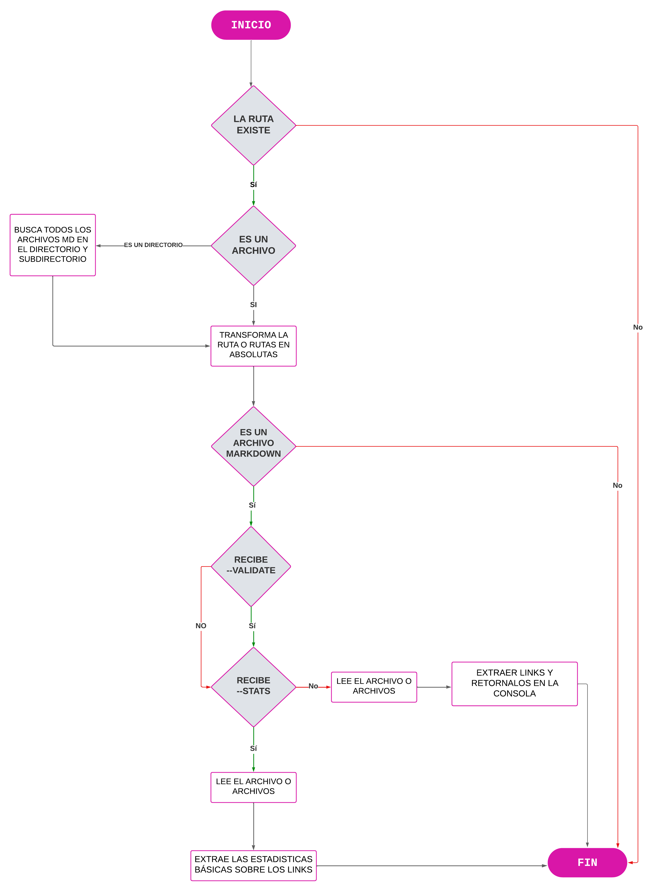
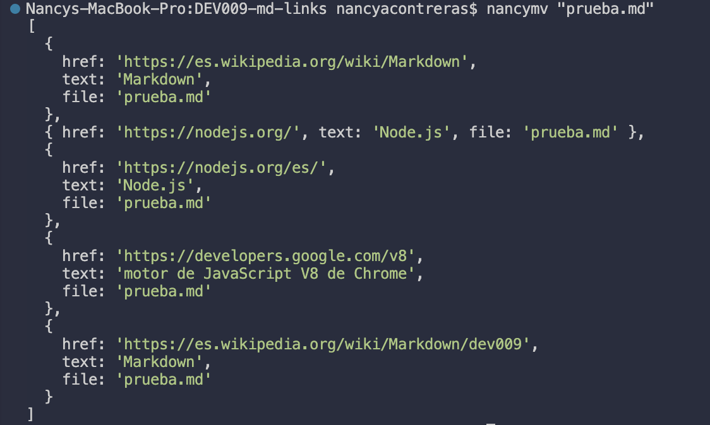
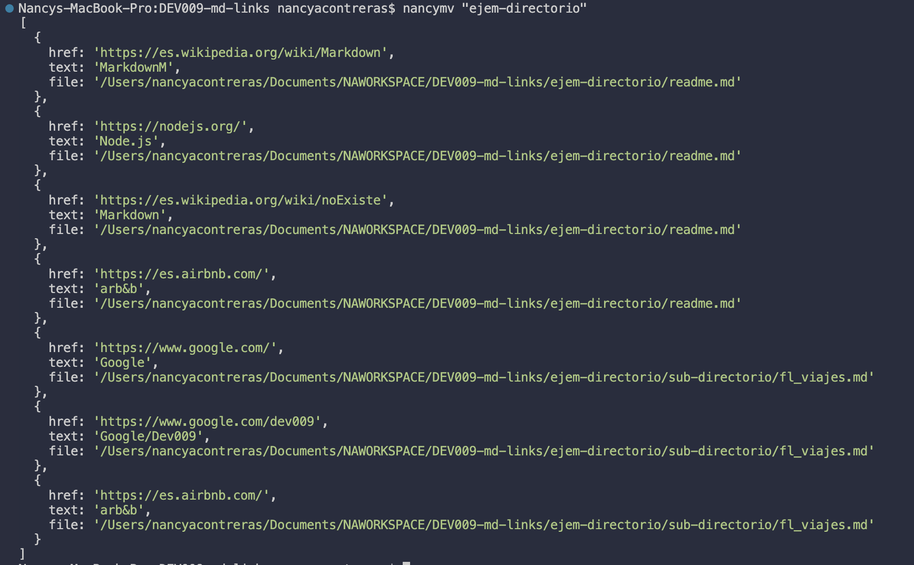

# Markdown Links

## Índice

* [1. Preámbulo](#1-preámbulo)
* [2. Resumen del proyecto](#2-resumen-del-proyecto)
* [3. Documentación técnica de la libreria](#3-documentación-técnica-de-la-libreria)
* [4. Diagrama de flujo](#4-diagrama-de-flujo)
* [5. Descripción de los archivos del proyecto](#5-descripción-de-los-archivos-del-proyecto)
* [6. Hitos](#6-hitos)

* [7. Guía de uso](#7-guía-de-uso)
* [8. Planificación del proyecto](#8-planificación-del-proyecto)

***

## 1. Preámbulo

[Markdown](https://es.wikipedia.org/wiki/Markdown) es un lenguaje de marcado
ligero muy popular entre developers. Es usado en
muchísimas plataformas que manejan texto plano (GitHub, foros, blogs, etc.) y
es muy común encontrar varios archivos en ese formato en cualquier tipo de
repositorio (empezando por el tradicional `README.md`).

Estos archivos `Markdown` normalmente contienen _links_ (vínculos/ligas) que
muchas veces están rotos o ya no son válidos y eso perjudica mucho el valor de
la información que se quiere compartir.

Se ha creado una herramienta usando [Node.js](https://nodejs.org/), que lea y analice archivos
en formato `Markdown`, para verificar los links que contengan y reportar
algunas estadísticas.

## 2. Resumen del proyecto

En este proyecto se desarrollo una librería en Node.js que funciona como
herramienta para analizar links dentro de archivos Markdown. Esta librería
esta disponible de dos formas: como un módulo publicado en GitHub, que las
usuarias podrán instalar e importar en otros proyectos, y como una interfaz
de línea de comandos (CLI) que permite utilizar la librería directamente
desde el terminal.
## 3. Documentación técnica de la libreria

* Para este proyecto, se utilizaron los módulos CommonJS con la síntaxis `require` y el formato
de módulos original de Node.js.
* Se usaron funciones asíncronas utilizando `readFile`. Además, del módulo `fs/promises`, la versión promisificada de las funciones como
  [`readFile`](https://nodejs.org/dist/latest-v18.x/docs/api/fs.html#fspromisesreadfilepath-options).

* Para la recursividad, se utilizó la versión síncrona de la función para leer directorios, `readdirSync`.

## 4. Diagrama de flujo

El proyecto se basa en un proceso lógico compuesto por diferentes pasos. Para
comprender mejor lo que se debía hacer y planificar las tareas y objetivos, se desarrollo un diagrama de flujo.

## 5. Descripción de los archivos del proyecto

* `README.md` descripción del módulo, instrucciones de instalación/uso,
  documentación del API y ejemplos. Contiene todo lo relevante para que cualquier
  developer que quiera usar tu librería pueda hacerlo sin inconvenientes.
* `index.js`: Contiene la función (`mdLinks`).
* `package.json` Contiene la configuración de nombre, versión, descripción, autores, licencia,
  dependencias, scripts (pretest, test, ...), main, bin
* `.editorconfig` con configuración para editores de texto. Este archivo no se
  debe cambiar.
* `.eslintrc` con configuración para linter. Este archivo contiene una
  configuración básica para ESLint, si deseas agregar reglas adicionales
  como Airbnb deberás modificar este archivo.
* `.gitignore` para ignorar `node_modules` u otras directorios que no deban
  incluirse en control de versiones (`git`).
* `test/md-links.spec.js` contiene los tests unitarios para la `función mdLinks`.
  `test/data.spec.js` contiene los test para las `funciones puras`. 

## 6. Hitos

Este proyecto se fue construyendo por hitos. A continuación se  muestran los hitos que se fuerón trabajando:

* [Hito 1](./docs/01-milestone.md)
* [Hito 2](./docs/02-milestone.md)
* [Hito 3](./docs/03-milestone.md)
* [Hito 4](./docs/04-milestone.md)
* [Hito 5](./docs/05-milestone.md)

## 7. Guía de uso 

Uso de la línea de comandos El ejecutable de la aplicación de realiza en la terminal de la siguiente manera:

`nancymv <path-to-file>`

Al ejecutar y pasarle un archivo --> nancymv "prueba.md"

### Options 

Si pasamos la opción --stats el output (salida) será un texto con estadisticas básicas sobre los links.

Si pasamos la opción --validate, el módulo debe hacer una petición HTTP para averiguar si el link funciona o no. Si el link resulta en una redirección a una URL que responde ok, entonces consideraremos el link como ok.

Si se colocá --validate --stats se obtienen los links validados y las estadisticas basicas.

Al ejecutar y pasarle un directorio --> nancymv "ejem-directorio"

## 8. Planificación del proyecto

El projecto se planifico utilizando Github Projects 

[Github Projects](https://github.com/users/nancyale24/projects/3/views/1?layout=board) 

